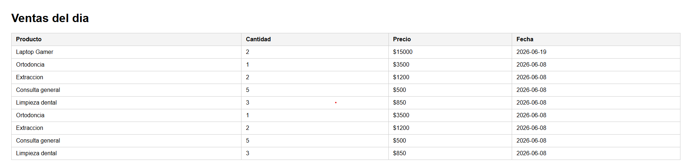

# 🏪 Sistema de Ventas

> Plataforma de gestión de ventas construida con Node.js, Express y SQLite

## 📋 Descripción

Sistema para la gestión y consulta de ventas, con API REST completa y exportación de reportes a Excel. Pensado como base para pequeños negocios que necesitan una solución ligera para administrar sus operaciones comerciales.

### 🚀 Características

- **API REST completa** - CRUD de ventas (crear, leer, actualizar, eliminar)
- **Base de datos SQLite** - Sin necesidad de servidor externo
- **Export a Excel** - Descarga de reportes en formato .xlsx
- **Interfaz web** - Tabla con las ventas registradas

## 🛠️ Tecnologías

- **Node.js** - Runtime JavaScript
- **Express** - Framework web
- **SQLite3** (better-sqlite3) - Base de datos ligera
- **ExcelJS** - Generación de reportes Excel
- **HTML/CSS** - Frontend vanilla

## 📦 Instalación

\`\`\`bash
git clone https://github.com/Alexisboop13/sistema-ventas.git
cd sistema-ventas
npm install
node datos.js
node server.js
\`\`\`

## 🔧 Configuración

El servidor corre por defecto en `http://localhost:3000`

## 📊 Endpoints API

| Método | Ruta | Descripción |
|--------|------|-------------|
| GET | `/` | Vista HTML con la tabla de ventas |
| GET | `/api/ventas` | Obtener todas las ventas (JSON) |
| GET | `/api/ventas/:id` | Obtener una venta específica |
| POST | `/api/ventas` | Registrar nueva venta |
| PUT | `/api/ventas/:id` | Actualizar una venta existente |
| DELETE | `/api/ventas/:id` | Eliminar una venta |
| GET | `/api/ventas/excel` | Descargar reporte de ventas en Excel |

## 📁 Estructura del Proyecto

\`\`\`
sistema-ventas/
├── server.js          # Servidor Express + API REST + export Excel
├── datos.js           # Seed script para poblar la base de datos
├── package.json       # Dependencias
├── ventas.db          # Base de datos SQLite (no versionada)
├── screenshots/        # Capturas del proyecto
└── node_modules/      # Dependencias (ignorado)
\`\`\`

## 📝 Licencia

MIT © Alexis Boop

---

**¿Te gustó el proyecto?** ⭐ No olvides dejar una estrella en GitHub